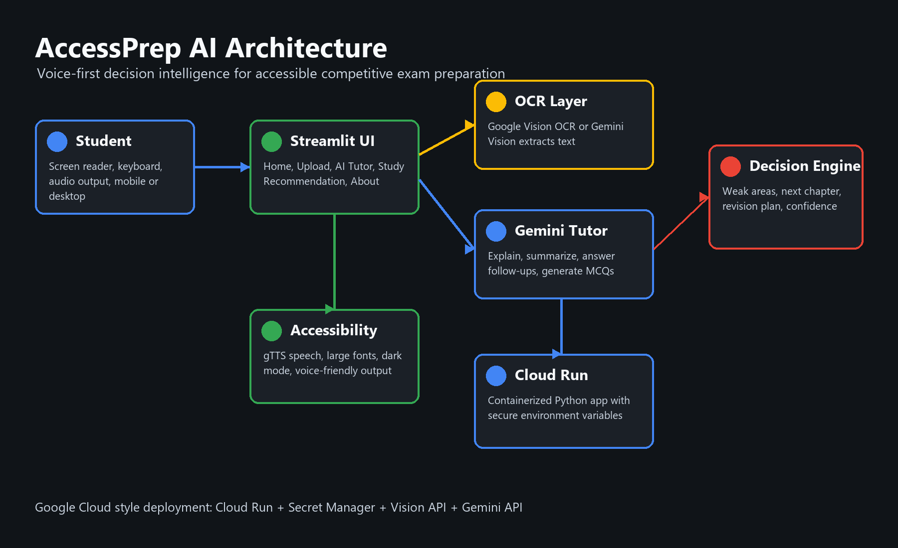

# AccessPrep AI

**AI-powered Decision Intelligence for Accessible Competitive Exam Preparation.**

Built by **Inclusive Intelligence Lab** - **AI for Every Ability.**

AccessPrep AI helps visually impaired students prepare for competitive examinations such as TNPSC, Railway, SSC, Banking, and UPSC by turning inaccessible images and PDFs into explanations, quizzes, audio, and personalized study recommendations.

## Problem

Visually impaired aspirants often receive learning material as scanned PDFs, photos, or non-screen-reader-friendly documents. OCR helps, but it does not provide conceptual explanations, follow-up tutoring, practice questions, revision prioritization, or a study plan.

## Solution

AccessPrep AI combines Computer Vision, OCR, Gemini-powered conversational AI, text-to-speech, and decision intelligence in one accessible Streamlit application.

Students can:

- Upload an image or PDF.
- Extract study text using Google Vision OCR or Gemini Vision.
- Ask Gemini to explain, summarize, and identify key points.
- Generate five MCQs with answers.
- Ask follow-up questions in a chat interface.
- Receive weak-topic analysis, next chapter suggestions, revision topics, study plan, and confidence level.
- Convert explanations and plans to speech using gTTS.

## Architecture



The application is designed for Google Cloud Run:

- **Streamlit UI**: accessible dark-mode web interface.
- **OCR Layer**: Google Cloud Vision OCR first, Gemini Vision fallback.
- **Gemini Tutor**: concept explanation, MCQ generation, and chat.
- **Decision Engine**: combines student profile and learning evidence.
- **Speech Layer**: gTTS audio output.
- **BigQuery Analytics**: optional learning event logging for usage insights.
- **Cloud Run**: containerized deployment with environment variables and optional Secret Manager integration.

## Features

- Professional Google Material-inspired UI.
- Large fonts, dark mode, keyboard-friendly navigation, and screen-reader-friendly text.
- Image and PDF upload with previews.
- OCR extraction from images and rendered PDF pages.
- Gemini-based explanation, summarization, MCQs, and conversational Q&A.
- Personalized study recommendations for exam preparation.
- Voice output for explanations, quizzes, and plans.
- Offline demo mode when API keys are not configured.
- Docker and Cloud Run deployment files.
- Vertex AI Gemini-ready configuration for Google Cloud deployments.
- Optional BigQuery learning event logging.
- Hackathon-ready PowerPoint and demo script.

## Folder Structure

```text
accessprep-ai/
  app.py
  prompts.py
  requirements.txt
  README.md
  LICENSE
  Dockerfile
  cloudbuild.yaml
  cloudrun-service.yaml
  architecture.png
  assets/
  components/
  demo/
  pages/
  ppt/
  scripts/
  utils/
  .github/
  .streamlit/
```

## Installation

```bash
python -m venv .venv
.venv\Scripts\activate
pip install -r requirements.txt
copy .env.example .env
streamlit run app.py
```

On macOS or Linux:

```bash
python3 -m venv .venv
source .venv/bin/activate
pip install -r requirements.txt
cp .env.example .env
streamlit run app.py
```

## Environment

Add your API keys or credentials in `.env`:

```text
GEMINI_API_KEY=
GOOGLE_APPLICATION_CREDENTIALS=
APP_ENV=development
```

If `GEMINI_API_KEY` is missing, the app still runs in offline demo mode. Google Vision OCR is used only when Google Cloud credentials are available; otherwise Gemini Vision can be used.

## Google Cloud Deployment

Build and run locally:

```bash
docker build -t accessprep-ai .
docker run -p 8080:8080 --env-file .env accessprep-ai
```

Deploy to Cloud Run:

```bash
gcloud artifacts repositories create accessprep-ai --repository-format=docker --location=asia-south1
gcloud builds submit --config cloudbuild.yaml --substitutions=_REGION=asia-south1
```

Recommended Google Cloud services:

- Cloud Run for hosting.
- Artifact Registry for container images.
- Secret Manager for `GEMINI_API_KEY`.
- Vision API for document OCR.
- Vertex AI Gemini for managed Google Cloud AI inference.
- BigQuery for anonymized learning-event analytics.
- Cloud Logging for monitoring.

## No-Billing Google Cloud Demo Alternate

If billing cannot be enabled, Cloud Run deployment will not proceed because Google Cloud requires billing for Artifact Registry and Cloud Build activation. For a no-payment live demo that still runs on Google Cloud infrastructure, use **Google Cloud Shell Web Preview**:

```bash
cd ~
rm -rf accessprep-ai
git clone https://github.com/kaaviya-ai/accessprep-ai.git
cd accessprep-ai
python3 -m pip install --user -r requirements.txt
python3 -m streamlit run app.py --server.port 8080 --server.address 0.0.0.0 --server.headless true
```

Then choose **Cloud Shell Web Preview -> Preview on port 8080**.

Detailed steps are included in `demo/google_cloud_shell_demo.md`.

## GitHub-Based Public Deployment

GitHub Pages cannot host this project because AccessPrep AI is a Python Streamlit application. For a GitHub-connected public deployment, use Streamlit Community Cloud:

1. Open https://share.streamlit.io/
2. Sign in with GitHub.
3. Choose repository `kaaviya-ai/accessprep-ai`.
4. Choose branch `main`.
5. Set main file path to `app.py`.
6. Add `GEMINI_API_KEY` in Streamlit secrets.
7. Deploy and use the generated public URL for submission.

## Submission Template Alignment

This repository addresses the prototype submission deck requirements:

- **Participant details**: Inclusive Intelligence Lab, AccessPrep AI.
- **Idea brief**: Accessible competitive exam preparation for visually impaired students.
- **Approach and impact**: OCR + Gemini + decision intelligence creates actionable study guidance.
- **USP**: Voice-first exam tutor that combines content extraction, conversational learning, quizzes, and personalized recommendations.
- **Features**: Upload, OCR, explain, summarize, chat, MCQs, recommendations, speech output.
- **Process flow**: Upload -> OCR -> AI Tutor -> Decision Engine -> Speech Output.
- **Wireframes and prototype snapshots**: Implemented as Streamlit pages with sidebar navigation.
- **Architecture**: Included in `architecture.png`.
- **Google services**: Cloud Run, Vision API, Gemini API, Vertex AI Gemini readiness, BigQuery analytics, Artifact Registry, Secret Manager, Cloud Logging.
- **NVIDIA services**: Not applicable because this solution targets the Google Cloud Gen AI track.

## Hackathon Assets

- Architecture diagram: `architecture.png`
- PowerPoint: `ppt/presentation.pptx`
- Demo script: `demo/demo_script.md`
- Logo: `assets/logo.svg`

## Future Work

- Speech input for hands-free question asking.
- Tamil and other Indian regional language support.
- Braille display integration.
- Offline study packs for low-connectivity learners.
- Adaptive mock tests and performance analytics.
- Teacher and mentor dashboards.

## License

This project is licensed under the MIT License.
